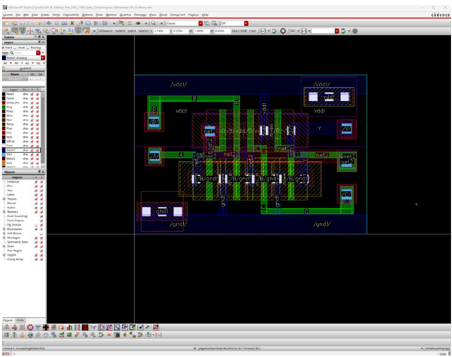
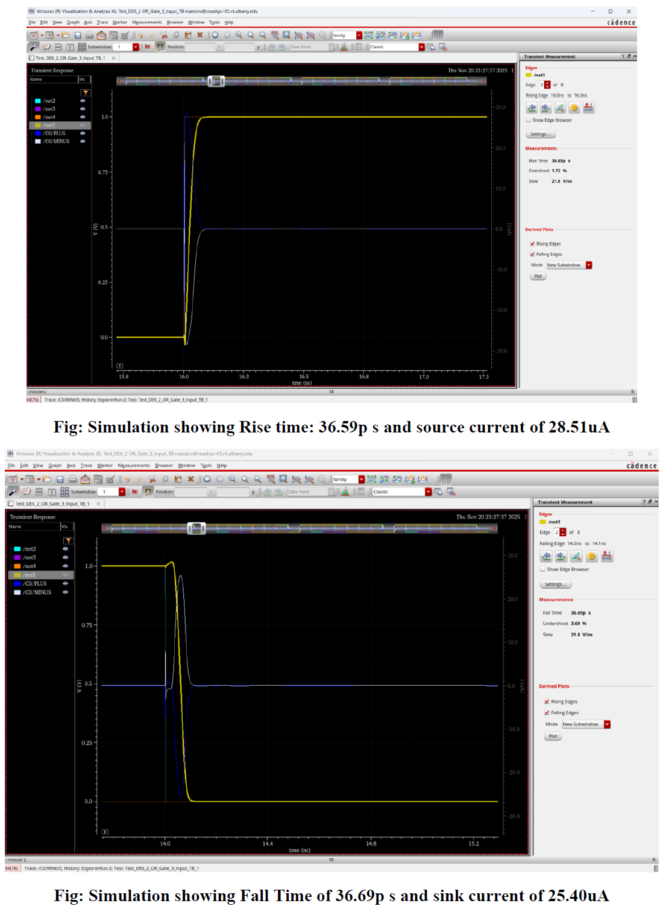

# vlsi-or-gate-design
Designed and verified a 3-input CMOS OR-Gate using Cadence Virtuoso 45 nm process
# VLSI Project: CMOS 3-Input OR Gate Design (45 nm)

📅 **Degree**: M.S. in Electrical and Computer Engineering
📅 **Course**: VLSI Design  
🏫 **Institution**: University at Albany, SUNY  
👨‍🏫 **Instructor**: Professor James R. Moulic  
🛠️ **Tools Used**: Cadence Virtuoso (gpdk045), DRC, Simulation, Maestro

---

## 📄 Project Description

This project involves the schematic design, layout, and simulation of a CMOS 3-input OR gate using the 45 nm gpdk045 PDK in **Cadence Virtuoso**. Key stages include schematic capture, symbol creation, testbench simulation, layout design, and DRC verification.

---

## 🧪 Results Summary

- ✅ Rise Time: 36.59 ps  
- ✅ Fall Time: 36.69 ps  
- ✅ Source Current: 28.51 μA  
- ✅ Sink Current: 25.40 μA  
- ✅ DRC: Passed (no errors)

---

## 🖼️ Key Screenshots

### 🔧 Layout with DRC Pass



### 📈 Simulation Timing Results



---

## 📥 Final Report

📘 [Download Final Report (PDF)](Report/OR_Gate_Cad_Virtuoso_v2.pdf)

---

## 📂 File Structure

```
├── Code
├── Cadence_Layout/
│ ├── Layout.png
│ ├── Detail_Layout.png
│ ├── Layout_DRC_Pass.png
│ ├── Timing_Verification.png
├── Report/
│ └── OR_Gate_Cad_Virtuoso_v2.pdf
├── README.md
```

---

## 📥 Downloads

- 📘 [Final Report (PDF)](OR_Gate_Cad_Virtuoso_v2.pdf)  
- 🌐 [Portfolio Website](https://drsarojshah.github.io)  

---

## 📫 Contact

- 📧 Email: engsarojshah@gmail.com 
- 🔗 LinkedIn: [linkedin.com/in/saroj-s-763265226](https://linkedin.com/in/saroj-s-763265226)

---
